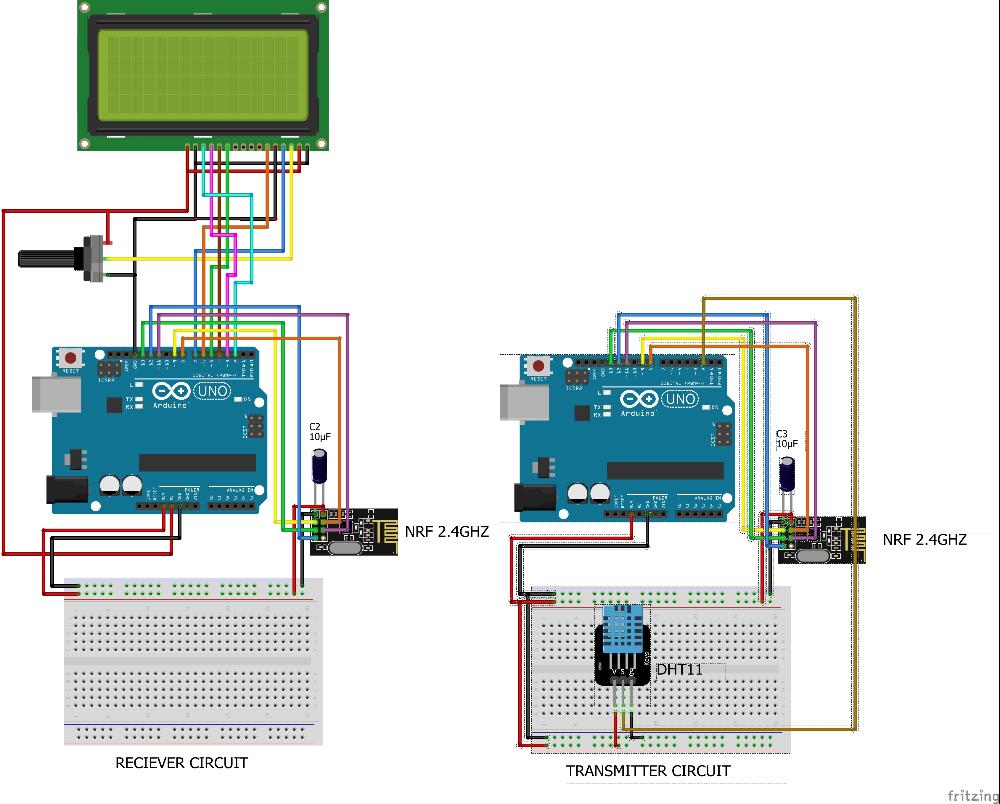

# DHT Sensor & nRF24L01 Wireless Data Transmission

This Arduino project reads temperature and humidity data from a DHT sensor (configured for DHT22) and wirelessly transmits the data using an nRF24L01 radio module. The data is also printed to the Serial Monitor for debugging and monitoring purposes.

  


---

## Table of Contents
- [Overview](#overview)
- [Features](#features)
- [Requirements](#requirements)
- [Installation](#installation)
- [Usage](#usage)


---

## Overview
This project demonstrates how to combine sensor data acquisition with wireless communication using Arduino. It leverages the following:
- **DHT Sensor (DHT22):** Reads temperature (in Celsius, Fahrenheit, and Kelvin) and humidity.
- **nRF24L01 Radio Module:** Transmits the sensor data wirelessly.
- **Serial Output:** Prints sensor readings to the Serial Monitor for verification.

The code uses a custom data structure to package the sensor readings and sends this package over the nRF24L01 module.

---

## Features
- **Temperature & Humidity Monitoring:** Reads data from a DHT sensor.
- **Multiple Temperature Units:** Outputs temperature in Celsius, Fahrenheit, and Kelvin.
- **Wireless Data Transmission:** Sends sensor data using an nRF24L01 transceiver.
- **Serial Debugging:** Prints sensor data to the Serial Monitor for easy debugging.
- **Robust Error Handling:** Checks for failed sensor readings and alerts via Serial output.

---

## Requirements
- **Hardware:**
  - Arduino board (e.g., Arduino Uno, Nano, etc.)
  - DHT Sensor (DHT22)
  - nRF24L01 radio module
  - Breadboard and connecting wires

- **Libraries:**
  - [SPI](https://www.arduino.cc/reference/en/language/functions/communication/spi/)
  - [nRF24L01](https://github.com/maniacbug/RF24)
  - [RF24](https://github.com/maniacbug/RF24)
  - [DHT Sensor Library](https://github.com/adafruit/DHT-sensor-library)

Install the required libraries via the Arduino Library Manager or download them from GitHub.

---

## Installation

1. **Clone the Repository:**

    ```bash
    git clone https://https://github.com/ikechiamaka/DHT-Sensor-nRF24L01-Wireless-Data-Transmission.git
    cd dht-nrf24l01-project
    ```

2. **Open the Project:**
   - Open the project folder in the Arduino IDE.
   - Make sure to install all required libraries through the Arduino Library Manager.

3. **Connect the Hardware:**
   - **DHT Sensor:** Connect the data pin to digital pin 2 (as defined in the code).
   - **nRF24L01 Module:** Connect the CE and CSN pins to digital pins 9 and 8 respectively.
   - Connect the power and ground wires appropriately.

---

## Usage

1. **Upload the Code:**
   - Connect your Arduino board to your computer.
   - Upload the code using the Arduino IDE.

2. **Open Serial Monitor:**
   - Open the Serial Monitor (set to 9600 baud) to view the sensor data.
   
3. **Data Transmission:**
   - The sensor data is read every 2 seconds.
   - Data is transmitted wirelessly via the nRF24L01 module.
   - Verify data reception on the corresponding receiver setup.

---


